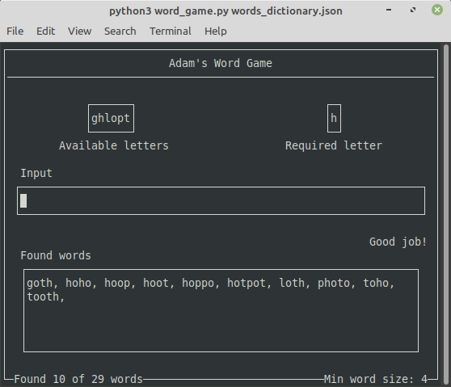

## Adam's Word Game
This is word-guessing game, where you are given a few letters along with
one required letter to make into words. 

To play it, you need a dictionary file in json format. You can find one of
those [here](https://github.com/dwyl/english-words/blob/master/words_dictionary.json). Run it with "python3 word\_game.py /<dict file/>".

You can customise the game a bit with a settings menu, or just hit
enter right away to begin the game with default settings. If you choose your
own letters, the first letter you enter will be the required one.

## Anagram Generator
This is used by word\_game.py to pick all the relevant words out the dictionary, but you can use it too with "python3 anagram\_generator.py \<dict file\> \<letters\>". This is a good way to cheat if you just can't get the last few words. Note that the first letter in \<letters\> is the one that it understands to be the required letter (i.e. it will be in every word).

## Screenshots

